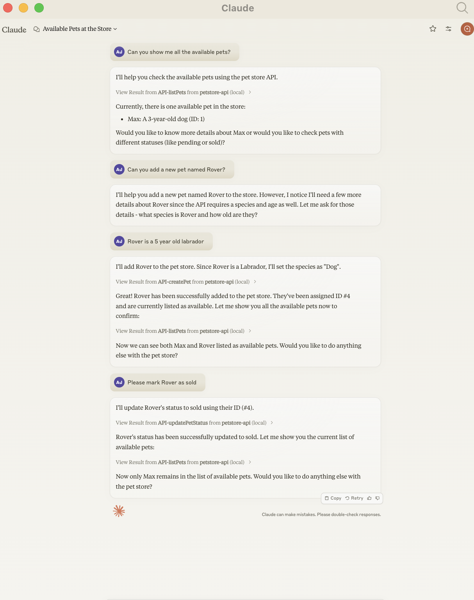

# Example Petstore API Server

This is a simple example API server that implements a basic pet store. It's useful for testing the OpenAPI MCP Server.



## Running the server

```bash
# Install dependencies
npm install express

# Start the server
node examples/petstore-server.cjs
```

The server will start on http://localhost:3000 with the following endpoints:

- GET /pets - List all pets
- GET /pets/{id} - Get a specific pet
- POST /pets - Create a new pet
- PUT /pets/{id} - Update a pet's status
- DELETE /pets/{id} - Delete a pet

The OpenAPI specification is available at http://localhost:3000/openapi.json

## Testing with Claude

1. Start the server as described above
2. Configure Claude Desktop to use the OpenAPI MCP Server with this spec:
   ```json
   {
     "mcpServers": {
       "petstore-api": {
         "command": "npx",
         "args": ["openapi-mcp-server", "http://localhost:3000/openapi.json"]
       }
     }
   }
   ```
3. Restart Claude Desktop
4. Try asking Claude questions like:
   - "Can you show me all the available pets?"
   - "Can you add a new pet named Rover?"
   - "Please mark Rover as sold"
   - "Delete Rover :-("
